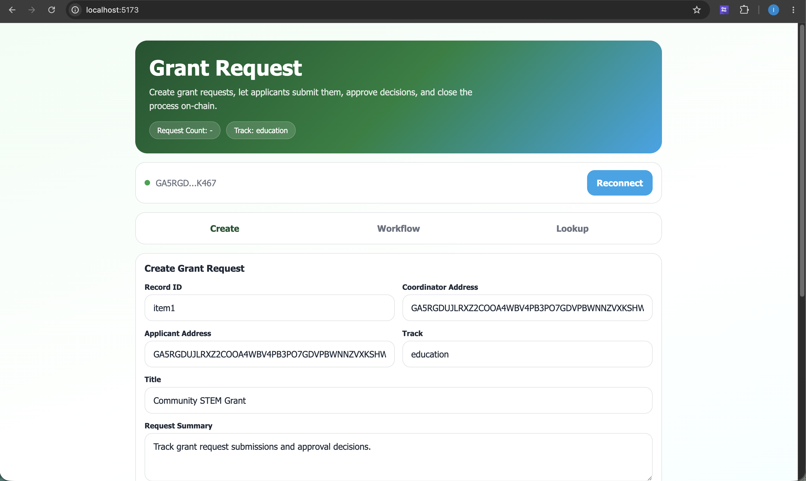
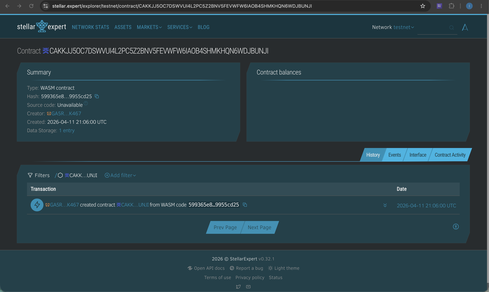

# Grant Request on Stellar

A React + Vite frontend connected to a Soroban smart contract on Stellar Testnet for creating grant request records, submitting review actions, approving decisions, and closing requests on-chain.

**Vite · React · Soroban · Freighter · Testnet**

## Overview

This repo is a decentralized grant request review app built on the Stellar Soroban platform. It pairs a React dashboard with a Soroban smart contract that stores grant request records on-chain, supports applicant submissions and coordinator approvals, and exposes lightweight queries for lookups and counts.

### What it does

- Create grant request records
- Submit review checks
- Approve a request
- Close a request
- Fetch a single request
- List all request IDs
- Get the request count for a record

The frontend uses Freighter for wallet access and transaction signing, while read operations are simulated through the Soroban RPC endpoint.

## On-Chain Details

| Item | Value |
|---|---|
| Freighter wallet address | User-selected Freighter account |
| Contract ID | `CAKKJJ5OC7DSWVUI4L2PC5Z2BNV5FEVWFW6IAOB4SHMKHQN6WDJBUNJI` |
| Network | Stellar Testnet |
| Soroban RPC | `https://soroban-testnet.stellar.org` |
| Stellar Expert contract page | https://stellar.expert/explorer/testnet/contract/CAKKJJ5OC7DSWVUI4L2PC5Z2BNV5FEVWFW6IAOB4SHMKHQN6WDJBUNJI |

## Screenshots

### App Dashboard



### Stellar Expert Dashboard



## Features

### Frontend experience

- Freighter wallet connection with coordinator and applicant auto-fill
- Three-tab workflow: Create, Workflow, and Lookup
- Grant request creation form with title, details, tag, and timestamp
- Workflow actions for submitting a request, approving it, and closing it
- Query actions for single request lookup, request list, and request count
- Live request count badge in the hero section
- Contract output panel for transaction and query responses
- Loading states for async blockchain actions
- Confirmation flow before closing a request

### Smart contract behavior

- Stores grant request records on-chain
- Tracks coordinator, applicant, title, details, tag, status, request_count, created_at, and updated_at
- Prevents duplicate request IDs
- Restricts approval and closing to the original coordinator
- Prevents the same applicant from submitting the same request twice
- Prevents further actions once a request is closed
- Tracks request counts per record
- Exposes lightweight read methods for frontend consumption

## How It Works

### Write flow

For actions like creating a request, submitting a request, approving a request, or closing a request:

1. The app checks whether Freighter is connected.
2. The user authorizes and signs the transaction in Freighter.
3. The signed transaction is submitted to Soroban Testnet.
4. The app waits for confirmation and shows the transaction result.

### Read flow

For actions like fetching a request, listing requests, or getting the request count:

1. The app builds a read-only contract call.
2. It simulates the transaction against the Soroban RPC server.
3. The returned value is converted from Soroban types into native JavaScript data.

## Tech Stack

| Layer | Tools |
|---|---|
| Frontend | React 19, Vite |
| Wallet integration | `@stellar/freighter-api` |
| Stellar SDK | `@stellar/stellar-sdk` |
| Smart contract | Rust + `soroban-sdk` |
| Explorer | Stellar Expert |
| Network | Stellar Testnet |

## Project Structure

```text
.
|-- contract/
|   |-- Cargo.toml
|   |-- README.md
|   `-- contracts/
|       `-- hello-world/
|           |-- Cargo.toml
|           |-- Makefile
|           `-- src/
|               |-- lib.rs
|               `-- test.rs
|-- lib/
|   `-- stellar.js
|-- public/
|   |-- ss1.png
|   `-- ss2.png
|-- src/
|   |-- App.jsx
|   |-- App.css
|   |-- index.css
|   `-- main.jsx
|-- package.json
`-- README.md
```

## Key Files

- `src/App.jsx` — Grant request dashboard UI and workflow interactions
- `lib/stellar.js` — Freighter integration, contract calls, signing, and RPC reads
- `contract/contracts/hello-world/src/lib.rs` — Soroban smart contract implementation

## Contract Interface

| Method | Type | Purpose |
|---|---|---|
| `create_request` | Write | Creates a new grant request record |
| `submit_request` | Write | Submits a request and increments the request count |
| `approve_request` | Write | Marks the request as approved |
| `close_request` | Write | Closes the request and prevents further actions |
| `get_request` | Read | Returns a single request by ID |
| `list_requests` | Read | Returns all known request IDs |
| `get_request_count` | Read | Returns the request count for a request |

## Grant Request Model

Each on-chain grant request stores:

- coordinator
- applicant
- title
- details
- tag
- status
- request_count
- created_at
- updated_at

## Getting Started

### Prerequisites

- Node.js and npm
- Freighter wallet browser extension
- A funded Stellar Testnet account in Freighter
- Rust and Cargo if you want to work on the contract locally
- Stellar CLI if you want to build the Soroban contract from the contract workspace

### Install dependencies

```bash
npm install
```

### Run the frontend

```bash
npm run dev
```

### Build the frontend

```bash
npm run build
```

### Preview the production build

```bash
npm run preview
```

## Contract Development

From the `contract/contracts/hello-world` directory, the included Makefile supports:

- Build the contract

```bash
make build
```

- Run contract tests

```bash
make test
```

- Format Rust code

```bash
make fmt
```

## Frontend Configuration Notes

The frontend contract settings are currently defined in `lib/stellar.js`:

```js
export const CONTRACT_ID =
  "CAKKJJ5OC7DSWVUI4L2PC5Z2BNV5FEVWFW6IAOB4SHMKHQN6WDJBUNJI";
export const DEMO_ADDR =
  "GA5RGDUJLRXZ2COOA4WBV4PB3PO7GDVPBWNNZVXKSHWA6GQNS5WYK467";
const RPC_URL = "https://soroban-testnet.stellar.org";
```

These values power:

- contract reads through Soroban RPC simulation
- contract writes signed through Freighter
- the testnet contract integration used by the grant request dashboard

## User Flow

- Connect Freighter.
- The app auto-fills coordinator and applicant wallet fields.
- Create a grant request record with title, details, track, and timestamp.
- Submit the request from the applicant side.
- Approve the request as the coordinator when review is complete.
- Close the request when the workflow is closed.
- Query individual requests, the request list, and the request count.
- Review transaction and query output in the contract output panel.

## Notes

- This app is configured for Stellar Testnet, not Mainnet.
- Read operations do not require signing because they use RPC simulation.
- Write operations require wallet authorization in Freighter.
- Request creation requires a non-empty title and a valid timestamp.
- Only the original coordinator can approve or close a request.
- An applicant cannot submit the same request twice.
- Closed requests reject further workflow actions.
- Request counts are tracked on-chain per request record.

## Useful Links

- [Stellar Expert deployed contract](https://stellar.expert/explorer/testnet/contract/CAKKJJ5OC7DSWVUI4L2PC5Z2BNV5FEVWFW6IAOB4SHMKHQN6WDJBUNJI)
- [Freighter Wallet](https://www.freighter.app/)
- [Soroban documentation](https://soroban.stellar.org/)
- [Stellar Developer Docs](https://developers.stellar.org/)

## Summary

This repository showcases a complete mini dApp on Stellar: a React frontend, Freighter wallet integration, and a Soroban smart contract powering an on-chain grant request workflow. It is a strong starter project for experimenting with approval pipelines, applicant submissions, status transitions, wallet-authenticated transactions, and Testnet deployment on Stellar.
